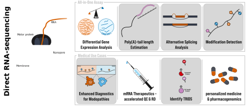

# RNA004-Manuscript
  
  
 This repository is a complement to our research paper _"Direct RNA sequencing enables improved transcriptome assessment and tracking of RNA modifications for medical applications"_ and organized as follows:  
- main
  - main basecalling options and settings like QC via NanoComp, or featureCounts that are in use for most of the paper. Not included are variations, that were in use for a specific subsection of the paper only.
- post-processing
  - post-processing steps, such as the extraction of the modified positions into the mod bed files.
  - DRACH-motif analyses, to see which DRACH motifs are preferentially used in native or IVT samples,
  - custom calling and alignment for the targeted vector system, etc.
- plotting
  - the scripts that faciliate plotting for the main and supplementary figures in this paper. The scripts take tabular input files from either main or post-processing.
- references
  - the FASTA files and annotations that were used throughout the paper, such as GRCh38 primary assembly or RCS.  
  
### Starting points
You  want to know which reference was used for the alignment in the targeted reporter system (Custom vector)? &rarr; Head on over to the .  
You want to know how the dorado standard model was modified to include calling for potentially misbascecalled C-bases? &rarr; Head on over to the .  
You have not found your item in question/You have an additional question? &rarr; Head on over to the .  
We welcome your feedback :)

